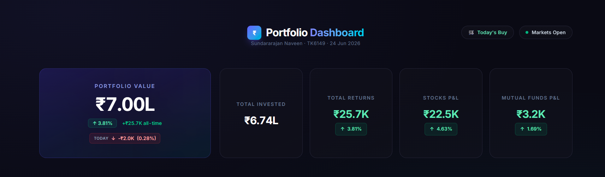
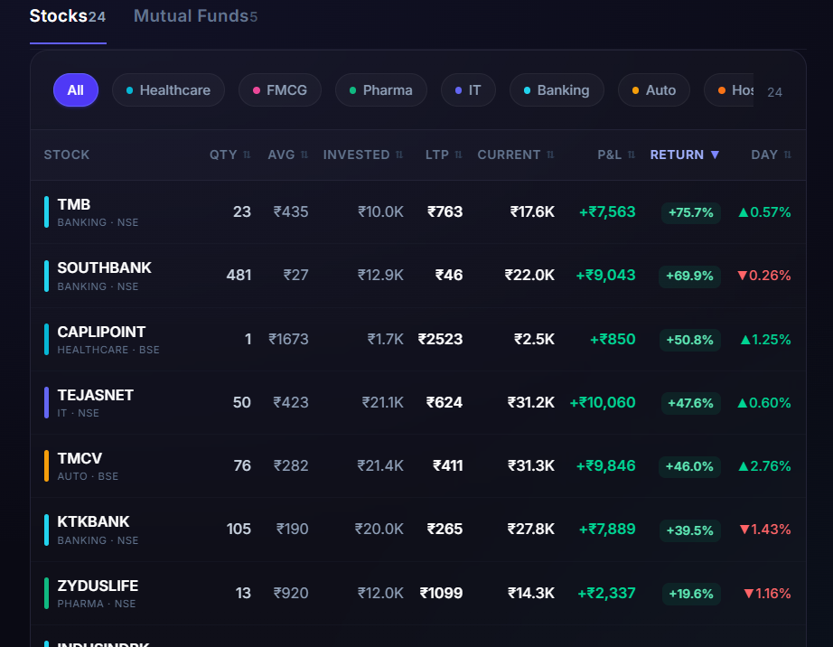
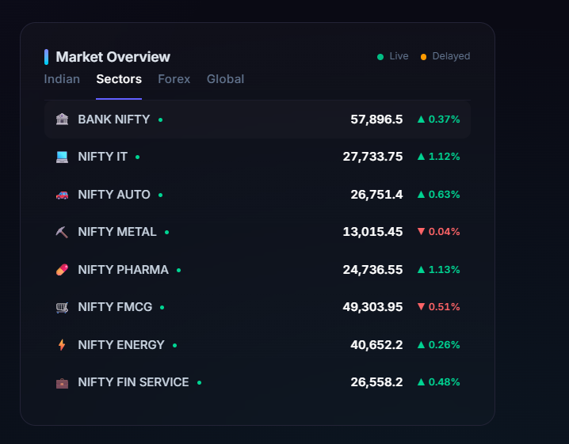
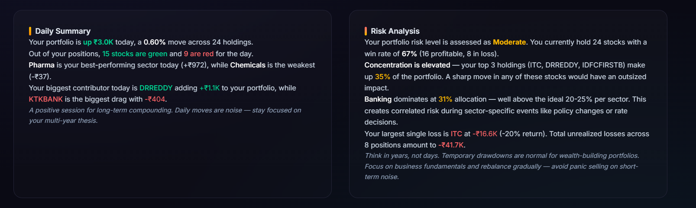
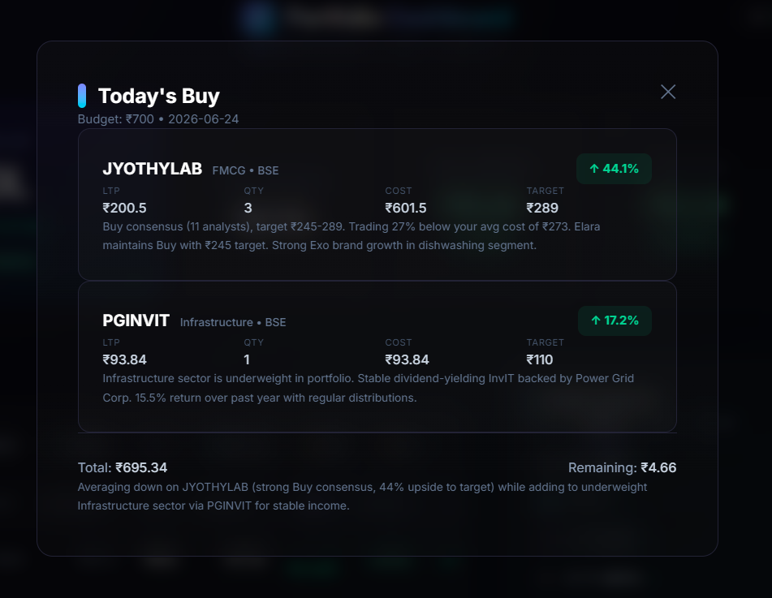
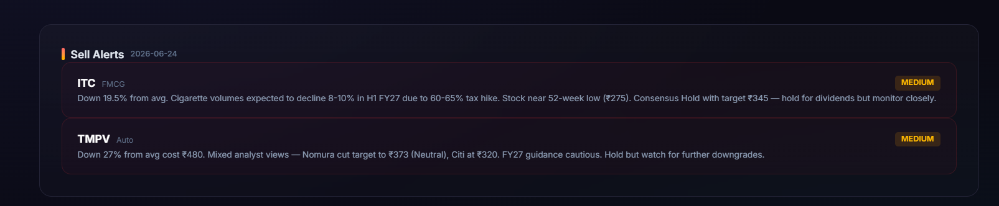

# 📊 Zerodha Portfolio Dashboard

A real-time portfolio tracking dashboard built with React, powered by Zerodha's Kite API via MCP (Model Context Protocol). Fetches live stock and mutual fund holdings data and presents it through an elegant, dark-themed UI.

[](https://react.dev)
[](https://vite.dev)
[](https://tailwindcss.com)
[](https://kite.trade/connect/docs)

## 📸 Screenshots













## ✨ Features

- **Portfolio Summary** — Total value, all-time returns, and daily P&L at a glance
- **Stock Holdings Table** — Sortable table with sector filters, P&L breakdown, and day change
- **Mutual Fund Holdings** — MF portfolio with NAV tracking and category-wise returns
- **Sector Allocation Chart** — Interactive donut chart showing portfolio distribution
- **Top Movers** — Best and worst performers of the day
- **Live Market Ticker** — Real-time index data (Nifty 50, Sensex, Bank Nifty)
- **AI-Powered Risk Analysis** — Concentration risk, sector exposure, and win-rate insights
- **Market Summary** — AI-generated market commentary with key levels
- **Today's Buy Suggestion** — AI-powered daily buy recommendations based on budget, sector diversification, and analyst consensus (shown as a modal popup)

## 🖼️ Tech Stack

| Layer | Technology |
|-------|-----------|
| Frontend | React 19, Vite 8 |
| Styling | Tailwind CSS 4 |
| Charts | Recharts |
| Data Source | Zerodha Kite API (via MCP) |

## 🚀 Getting Started

### Prerequisites

- Node.js 18+
- Any MCP-compatible AI client (Claude Desktop, Cursor, VS Code + Copilot, etc.)
- [Kite MCP Server](https://github.com/zerodha/kite-mcp) configured in your client
- Zerodha Kite account

### Installation

```bash
git clone https://github.com/yourusername/zerodha.git
cd zerodha
npm install
npm run dev
```

Open [http://localhost:5173](http://localhost:5173) in your browser.

### Refreshing Portfolio Data

Use any MCP-compatible client with the Kite MCP server to refresh data:

1. Authenticate with Zerodha via Kite OAuth
2. Call `get_holdings` and `get_mf_holdings` tools
3. Fetch live quotes via `get_quotes`
4. Write the updated data to `src/data/holdings.js`

The dashboard reads from this static data file — just refresh the browser after updating.

## 📁 Project Structure

```
src/
├── components/
│   ├── PortfolioSummary.jsx   # Hero card with total value & returns
│   ├── StockTable.jsx         # Holdings table with sorting & filtering
│   ├── MFTable.jsx            # Mutual fund holdings
│   ├── SectorChart.jsx        # Donut chart for sector allocation
│   ├── TopMovers.jsx          # Best/worst daily performers
│   ├── LiveTicker.jsx         # Market index ticker
│   ├── MarketSummary.jsx      # AI market commentary
│   ├── RiskAnalysis.jsx       # AI risk assessment
│   ├── TodaysBuy.jsx          # AI buy suggestion modal
│   └── Sparkline.jsx          # Mini sparkline charts
├── data/
│   ├── holdings.js            # Portfolio data (auto-updated via Kite MCP)
│   ├── todaysBuy.js           # Daily buy suggestions (AI-generated)
│   └── market.js              # Market/index data
├── App.jsx
├── main.jsx
└── index.css
```

## 🔄 How It Works

1. **Authenticate** — Login to Zerodha via Kite OAuth (daily, requires 2FA)
2. **Fetch** — Kite MCP pulls holdings, MF data, and live quotes
3. **Update** — Data written to `src/data/holdings.js`
4. **Buy Suggestion** — If market is open, AI asks your budget, analyzes sector allocation, researches analyst ratings, and writes suggestions to `src/data/todaysBuy.js`
5. **Render** — React dashboard reads the static data files and renders the UI (including a "Today's Buy" modal popup)

The dashboard is fully static after data refresh — no backend server required for hosting.

## 🤖 Agent Steering

This repo includes a `.kiro/steering/` directory with AI agent instructions that automate the portfolio refresh workflow. Any MCP-compatible AI client (Claude Desktop, Cursor, VS Code + Copilot, etc.) with the [Kite MCP Server](https://github.com/zerodha/kite-mcp) configured can follow these instructions.

**What it does**: When you say "refresh my portfolio", the agent follows `.kiro/steering/refresh-portfolio.md` to:
- Authenticate with Zerodha via Kite MCP
- Fetch live holdings and write to `src/data/holdings.js`
- Check if market is open, ask your budget, and generate buy suggestions

**Requirements**: Any MCP-compatible AI client + [Kite MCP Server](https://github.com/zerodha/kite-mcp) configured.

```
> refresh my portfolio
```

## 🛡️ Disclaimer

This is a personal portfolio tracker for educational and visualization purposes. It is not financial advice. AI-generated analysis (risk assessment, market summary) should not be used as the sole basis for investment decisions.

## 📄 License

MIT

---

*Built with ☕ and AI by [Naveen Sundararajan](https://www.linkedin.com/in/fse-naveen)*
